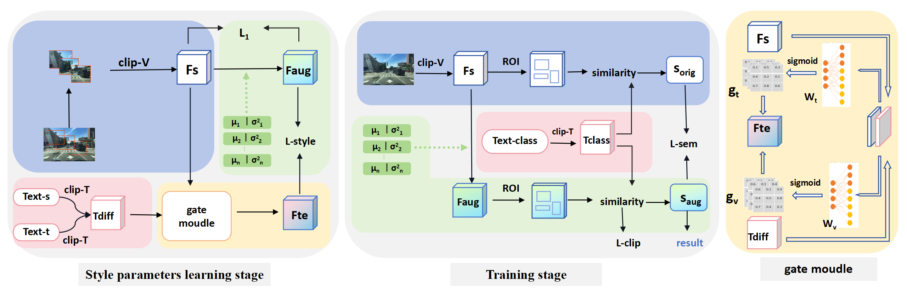

# SemClip: Enhancing Domain Generalization in Object Detection via Style Enhancement and Semantic Consistency



This manuscript has been submitted to The Visual Computer.

### Installation
Our code is based on [Detectron2](https://github.com/facebookresearch/detectron2) and requires python >= 3.6

Install the required packages
```
pip install -r requirements.txt
``` 

Download the pre-trained resnet weights
```
    path-to-parent-dir/
        /data
            /pretrained_model
    
``` 


### Datasets
Set the environment variable DETECTRON2_DATASETS to the parent folder of the datase

```
    path-to-parent-dir/
        /diverseWeather
            /daytime_clear
            /daytime_foggy
            ...
        /comic
        /watercolor
        /VOC2007
        /VOC2012 

```
Download [Diverse Weather](https://github.com/AmingWu/Single-DGOD) and [Cross-Domain](https://naoto0804.github.io/cross_domain_detection/) Datasets and place in the structure as shown.

### Training
We train our models on a single A800 GPU.
```
    python train.py --config-file configs/diverse_weather.yaml 

    or 

    python train_voc.py --config-file configs/comic_watercolor.yaml
```

### Testing
```
    python train.py --eval --config-file configs/diverse_weather.yaml 

```
